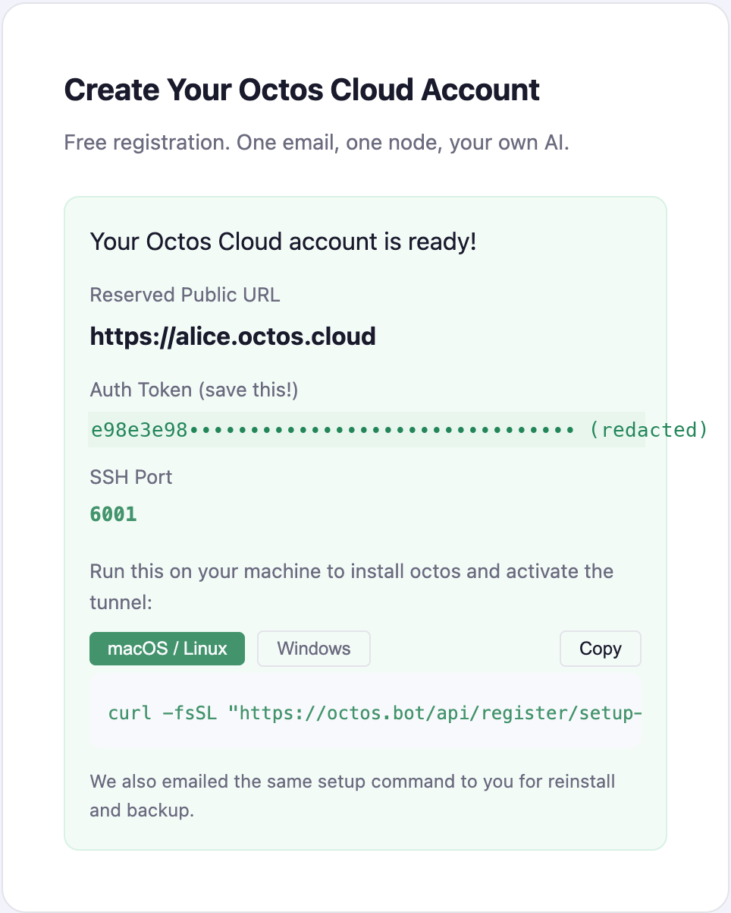

# octos-web

The web app for [octos](https://github.com/octos-org/octos). Chat with your agent, talk to it by voice or video, build slide decks and sites with it, and administer the whole server — from a browser.

## Just want to use it?

**You don't need this repo.** A production build of the web app ships inside the octos server itself:

```bash
brew install octos-org/tap/octos    # or: npm install -g @octos-org/octos
octos init                          # pick an AI provider, paste its API key
octos serve --solo                  # password-free local sign-in
```

Then open **http://localhost:50080/app/** and click the local sign-in button. (Installed octos as a background service via its install script? The app is at `http://localhost:8080/app/`.) Full walkthrough: the [octos Start here guide](https://github.com/octos-org/octos#start-here).

This repo is for **developing or customizing the client**. octos-web is one of two first-party clients for the octos server; the other is [octos-tui](https://github.com/octos-org/octos-tui) for the terminal.

## Octos Cloud

Don't want to run anything yourself? **Octos Cloud** is the hosted, multi-tenant way in — and the account experience (signup, email-code sign-in, your tenant's dashboard) is delivered by this web client:

1. Go to [octos.cloud](https://octos.cloud) (or your self-hosted operator's portal).
2. Register with your email.
3. Choose a custom node name.
4. Run the generated setup command on your device.

That setup command is personalized for your machine and includes the values needed to connect your device to the Octos cloud relay. After setup, your Octos instance is accessible on the public internet under your node name.

Two credentials come out of signup, and it pays to know which is which:

- **Signing in to the app** (`https://<your-name>.octos.cloud/app/`) uses your **email code** — same as the login page anywhere else.
- **The admin dashboard** (`https://<your-name>.octos.cloud/admin/`) accepts the **`--auth-token` value from your setup command**: pick the *"Login with admin token"* tab on its login screen and paste it. The same command was emailed to you at signup, so the token is always recoverable from that email (or from the service file the installer wrote on your device).

When you click `Send Code` on the portal, check your Spam folder if the email does not arrive right away. It is also a good idea to add the Octos sending domain/address to your address book so future login and setup emails are delivered reliably.

After signup, the portal shows your node details, public URL, and the setup command to run on your device:



Octos Cloud is the best choice if you want:

- the fastest time to first working system
- public access without running your own VPS
- a hosted signup and tunnel flow

Multi-tenant accounts, per-user isolation, and the admin surfaces for them are web-client territory; the terminal client stays single-user. **Operators**: the server-side infrastructure behind this — the portal host, relay, and wildcard TLS — is deployed from the octos repo; see [self-hosted cloud + tenant pair](https://github.com/octos-org/octos#option-3-self-hosted-cloud--tenant-pair).

## Surfaces

| Route | What it is |
|---|---|
| `/` | Project launcher — every chat, deck, and site as a project card |
| `/home` | Home-assistant standby — clock, weather/news/calendar/photo/smart-home widgets, night mode, wake-word |
| `/voice` | Voice assistant — on-device VAD, streamed TTS with barge-in, spoken transcripts, user-selectable voices, live video chat |
| `/chat` | The chat workbench — streaming turns, tool activity, approvals and clarifying-question cards, a context-compaction indicator with a manual `/compact` command, file uploads, rich media |
| `/studio/:projectId` | Studio — three-pane grounded workspace (sources · chat · skills) pinned to a project session |
| `/slides`, `/slides/:id/present` | Slide-deck gallery, editor, and full-screen present mode |
| `/sites`, `/sites/:id` | Generated-site gallery and editor with signed previews |
| `/settings` | Admin dashboard — LLM providers & failover, users, profiles, channels, sandbox, tools, system metrics & live logs, server watchdog, skills hub, voice, Ominix home, appearance |
| `/login` | Email-code login, or password-free solo login against `octos serve --solo` |

## Develop the client

Prereqs: Node 20.19+ (Vite 7's floor), and an octos server (install above). The client is a React SPA talking to the server over UI Protocol v1 (see [How it connects](#how-it-connects)).

**Stack:** React 19 · TypeScript · Vite 7 · Tailwind CSS 4 · react-router 7 · Vitest + Playwright.

```bash
# 1. Run the backend on :50080 (from anywhere)
octos serve --solo          # --solo = password-free local login; plain `octos serve` needs email-code (SMTP)

# 2. Run the web client in dev mode
npm ci
npm run dev                 # Vite dev server on http://localhost:5173
```

The dev server proxies `/api` (including the WebSocket upgrade) to `http://localhost:50080`, so the app is same-origin out of the box. Sign in with one click on the solo button (email-code login needs the server's SMTP configured).

### If something looks wrong

| Symptom | Fix |
|---|---|
| Blank app / WebSocket won't connect | Is the server running on **:50080**? (A service install listens on :8080 — point the proxy or your browser at the right one.) |
| Login code never arrives | The local server has no SMTP — run `octos serve --solo` and use the solo button instead. |
| `npm ci` or `npm run dev` fails | Check `node --version` — Vite 7 needs Node 20.19+. |

## Build, lint, test

`predev`/`prebuild` copy the VAD/onnx wasm assets (`scripts/copy-vad-assets.mjs`) automatically.

```bash
npm run build          # tsc -b && vite build  → dist/
npm run preview        # serve the production build locally
npm run lint           # eslint

npm run test:unit      # Vitest unit suite (~750 tests across 80+ files, jsdom, no server needed)
npm test               # Playwright e2e — needs the app + a LIVE octos server
npm run test:live:smoke   # fast live smoke subset
npm run test:live:long    # long-running live scenarios (deep research, TTS)
```

The unit suite is the merge gate. Playwright specs (in `tests/`) drive a real browser and exercise live server behavior — run them when touching transport, voice, or session flows. Their default `baseURL` is `http://localhost:5174` (override with `BASE_URL`); the Vite dev server listens on `:5173`, so point the specs at your dev server with `BASE_URL=http://localhost:5173` or serve a build on `:5174`.

## How it connects

- **Transport** — `src/runtime/ui-protocol-bridge.ts`: a strict, fail-closed JSON-RPC bridge over WebSocket at `/api/ui-protocol/ws`. Reconnects with exponential backoff, resumes with an `after` cursor + `session/hydrate`, and queues outbound RPCs while offline. This is the *only* chat transport (the legacy SSE/REST bridge is gone).
- **Events → state** — `src/runtime/ui-protocol-event-router.ts` routes typed notifications (`message/delta`, `message/persisted`, `turn/spawn_complete`, `tool/*`, approvals, `user_question.v1` cards, `context.lifecycle.v1` compaction events, …) into `src/store/thread-store.ts`, the single source of truth keyed by `client_message_id`. A pure projection layer (`src/store/projection.ts`, envelopes → view-model) runs behind the `octos_projection_v1` flag.
- **Auth** — session token (`octos_session_token`) and optional admin token (`octos_auth_token`) in localStorage; the WS handshake carries the token as a query parameter.

The protocol contract lives in the octos repo (`crates/octos-core/src/ui_protocol.rs` and the API docs). Server merges do not wait for client releases — the spec is the contract.

## Configuration

| Env var | Purpose |
|---|---|
| `BASE_URL` | Vite base path for subpath deploys (e.g. `/octos-web/`) |
| `VITE_SKIP_AUTH` | Build-time: skip the auth guard — static/demo builds only |
| `VITE_WEBHOOK_ORIGIN` / `VITE_PUBLIC_API_ORIGIN` | Origin used when displaying channel webhook URLs in settings (fallback order) |
| `VITE_SMART_HOME_API_BASE` | Smart-home widget backend (dev proxy: `/smart-home-api` → `:8787`) |

API and WebSocket traffic is always **same-origin** (`/api/...`) — serve the
bundle behind the same host as `octos serve` (or a reverse proxy to it);
there is no env var that repoints the API.

## Deploying

- **Static canary** — `.github/workflows/deploy.yml` publishes the app to GitHub Pages (`BASE_URL=/octos-web/`, SPA `404.html` fallback), plus the `book/` mdBook of sample research reports under `/book`. The workflow does not set `VITE_SKIP_AUTH`, so the Pages build still shows the login screen; export it yourself for an auth-free demo build.
- **Production** — build with `npm run build` and serve `dist/` from any static host or reverse proxy in front of `octos serve` (the octos repo's deploy docs cover the fleet setup). The app is a pure static bundle; all state lives in the server.

## Repository layout

```
src/
  runtime/     UI Protocol bridge, event router, runtime provider
  store/       thread-store, projection, voice/task/file/content/project stores
  components/  chat workbench, thread, composer, media
  home/        home-assistant surface, widget registry, voice assistant
  studio/      three-pane studio workspace
  settings/    admin dashboard tabs
  slides/  sites/  pages/  remaining surface modules
tests/         Playwright e2e specs
book/          mdBook sample reports (published to /book)
```

## License

MIT — see [LICENSE](LICENSE).
